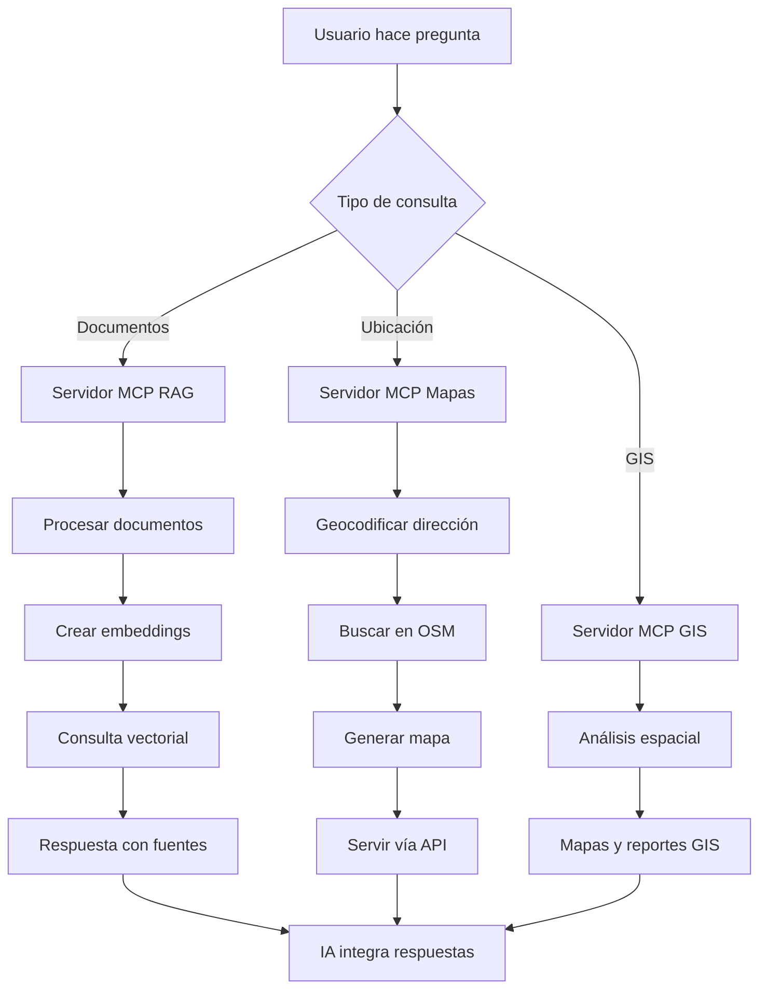

# Implementación detallada del MCP RAG GIS System

Este documento detalla la implementación, arquitectura, despliegue, uso y testing del sistema MCP RAG GIS, cubriendo los scripts y mejoras clave.

---

## 1. ¿Qué es MCP y su uso profesional?

**MCP (Model Context Protocol)** es un protocolo de comunicación que permite a los modelos de IA interactuar de forma segura y estandarizada con sistemas externos.

- **¿Cómo funciona?**
  - Actúa como puente entre IA y herramientas externas (bases de datos, APIs, archivos, etc.).
  - Define mensajes y operaciones estándar.
  - Permite ejecución segura y controlada de herramientas.

- **Usos profesionales:**
  - Integración de IA con ERP, CRM, bases de datos.
  - Automatización de flujos y RAG empresarial.
  - Acceso seguro a documentación interna y análisis de datos en tiempo real.

---

## 2. Implementación local: RAG, GIS, Mapas y MCP

### 2.1. Resumen del sistema

- **Servidor MCP RAG**: Procesa documentos locales (MD, PDF, CSV), genera embeddings y permite consultas inteligentes (Ollama + LangChain).
- **Servidor MCP Mapas**: Búsqueda de equipamientos públicos (OpenStreetMap), mapas interactivos con Folium.
- **Servidor MCP GIS**: Análisis espacial avanzado, cobertura, accesibilidad y optimización de localizaciones (PostgreSQL/PostGIS).
- **API REST (FastAPI)**: Endpoints para integración web y documentación automática.
- **Base vectorial (ChromaDB)**: Para consultas RAG eficientes.

### 2.2. Funcionalidades clave

- **RAG local**: Procesamiento automático de documentos, embeddings con `nomic-embed-text`, consultas con `llama3.2`, fuentes y metadatos.
- **Mapas y geolocalización**: Geocodificación (Nominatim), mapas HTML, ranking de distancias.
- **GIS avanzado**: Cobertura de servicios, análisis espacial, localización óptima, informes ejecutivos.

---

## 3. Arquitectura técnica y modular

- **Protocolo MCP**: Estandariza comunicación entre IA y herramientas. Herramientas como JSON schemas.
- **Stack**:
  - **Backend**: Python (FastAPI, asyncio)
  - **IA**: Ollama (local) + LangChain
  - **Datos**: ChromaDB, PostgreSQL/PostGIS, OSM
  - **Frontend**: Mapas HTML, API REST

**Estructura:**
```
mcp_rag_gis_system/
├── src/
│   ├── config/
│   ├── database/
│   ├── services/
│   ├── mcp_servers/
│   ├── api/
│   └── utils/
├── data/
├── scripts/
├── tests/
└── docker/
```

---

## 4. Flujo de trabajo



---

## 5. Instalación y despliegue

### 5.1. Instalación automática

```bash
git clone https://github.com/emilio1310Git/mcp_rag_gis_system.git
cd mcp_rag_gis_system
chmod +x scripts/install_system.sh
./scripts/install_system.sh
```

### 5.2. Inicialización de servicios

```bash
docker-compose -f docker/docker-compose.yml up -d
python scripts/install_ollama_models.py      # Descarga y prepara modelos IA
python scripts/setup_database.py             # Configura la base de datos GIS
python tests/test_complete_system.py         # Verifica todo el sistema
python scripts/run_servers.py                # Lanza los 3 servidores MCP
```

- Accede a la API REST y doc: [http://localhost:8000/docs](http://localhost:8000/docs)

---

## 6. Testing y validación

El script `test_complete_system.py` valida:

- Importaciones y configuración
- Sistema RAG (LangChain 0.3+)
- Mapas y geocodificación
- Base de datos PostgreSQL/PostGIS
- Análisis GIS y API REST
- Estructura de archivos

---

## 7. Uso profesional y ejemplos

- **Consultoría urbana**: Analizar documentos y mapas, informes de cobertura, zonas con déficit.
- **Administración pública**: Consultar normativas, localizar y optimizar servicios ciudadanos.
- **Desarrollo inmobiliario**: Evaluar proyectos, analizar accesibilidad.
- **Investigación académica**: Procesar literatura, análisis cuantitativo-espacial.

---

## 8. Extensiones y personalización

- **Nuevas fuentes**: Catastro, INE, datos municipales abiertos.
- **Análisis avanzados**: Rutas óptimas, dashboards, análisis temporal.
- **Integración empresarial**: Conectores ERP, CRM, sistemas GIS corporativos.

---

## 9. Scripts clave explicados

### 9.1. `scripts/run_servers.py`

- Configuración tipada con `@dataclass`.
- Logging estructurado, monitorización avanzada, cierre seguro.
- Dashboard visual con estado de servidores y endpoints disponibles.
- Producción-ready: robustez ante errores y documentado.

### 9.2. `scripts/setup_database.py`

- Verifica conexión, extensiones PostGIS, tablas y calidad de datos.
- Población automática (ejemplo: Madrid, Barcelona, Zaragoza).
- Reportes visuales, argumentos CLI (quick check, verbose, JSON).
- Idempotente y enterprise-ready.


------
## 10. Buenas prácticas y mantenimiento

- **Documentación exhaustiva**: Docstrings y comentarios en el código.
- **Type hints completos**: Para tipado estático y mantenimiento.
- **Modularidad**: Estructura desacoplada para extensiones futuras.
- **Testing**: Scripts automáticos y salidas visuales claras.
- **Privacidad y seguridad**: Ejecución local, sin exponer datos sensibles.

---

## 11. Troubleshooting y recomendaciones

- Verifica logs de `run_servers.py` y `setup_database.py` ante fallos.
- Asegura permisos de Docker y puertos libres.
- Revisa dependencias Python en `requirements.txt`.

---

## 12. Créditos y licencia

Desarrollado por emilio1310Git. Licencia MIT.