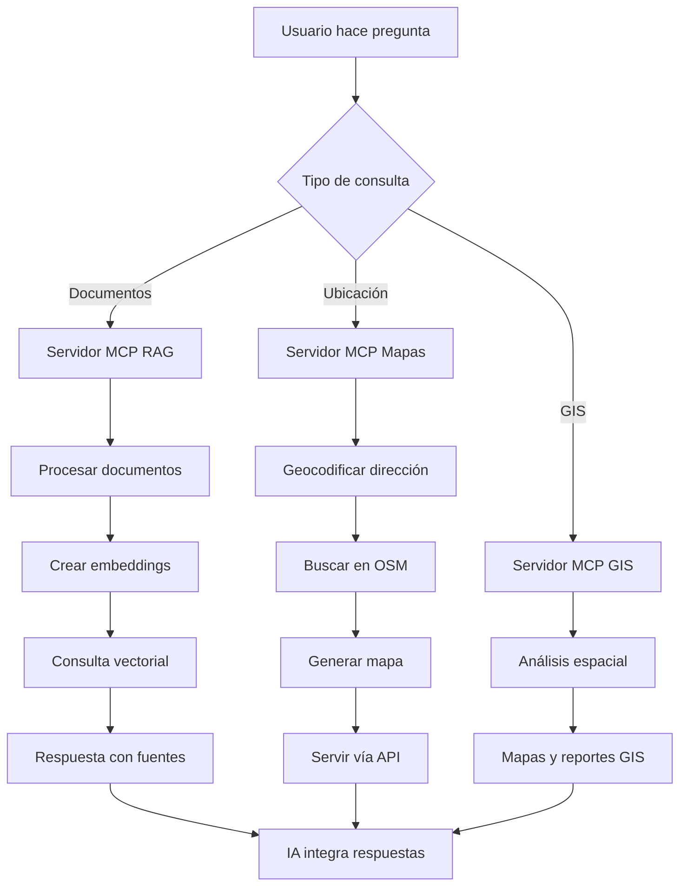

# Implementación detallada del MCP RAG GIS System

Este documento detalla la implementación, arquitectura, despliegue, uso y testing del sistema MCP RAG GIS, cubriendo los scripts y mejoras clave.

---

## 1. ¿Qué es MCP y su uso profesional?

**MCP (Model Context Protocol)** es un protocolo de comunicación que permite a los modelos de IA interactuar de forma segura y estandarizada con sistemas externos.

- **¿Cómo funciona?**
  - Actúa como puente entre IA y herramientas externas (bases de datos, APIs, archivos, etc.).
  - Define mensajes y operaciones estándar.
  - Permite ejecución segura y controlada de herramientas.

- **Usos profesionales:**
  - Integración de IA con ERP, CRM, bases de datos.
  - Automatización de flujos y RAG empresarial.
  - Acceso seguro a documentación interna y análisis de datos en tiempo real.

---

## 2. Implementación local: RAG, GIS, Mapas y MCP

### 2.1. Resumen del sistema

- **Servidor MCP RAG**: Procesa documentos locales (MD, PDF, CSV), genera embeddings y permite consultas inteligentes (Ollama + LangChain).
- **Servidor MCP Mapas**: Búsqueda de equipamientos públicos (OpenStreetMap), mapas interactivos con Folium.
- **Servidor MCP GIS**: Análisis espacial avanzado, cobertura, accesibilidad y optimización de localizaciones (PostgreSQL/PostGIS).
- **API REST (FastAPI)**: Endpoints para integración web y documentación automática.
- **Base vectorial (ChromaDB)**: Para consultas RAG eficientes.

### 2.2. Funcionalidades clave

- **RAG local**: Procesamiento automático de documentos, embeddings con `nomic-embed-text`, consultas con `llama3.2`, fuentes y metadatos.
- **Mapas y geolocalización**: Geocodificación (Nominatim), mapas HTML, ranking de distancias.
- **GIS avanzado**: Cobertura de servicios, análisis espacial, localización óptima, informes ejecutivos.

---

## 3. Arquitectura técnica y modular

- **Protocolo MCP**: Estandariza comunicación entre IA y herramientas. Herramientas como JSON schemas.
- **Stack**:
  - **Backend**: Python (FastAPI, asyncio)
  - **IA**: Ollama (local) + LangChain
  - **Datos**: ChromaDB, PostgreSQL/PostGIS, OSM
  - **Frontend**: Mapas HTML, API REST

**Estructura:**
```
mcp_rag_gis_system/
├── src/
│   ├── config/
│   ├── database/
│   ├── services/
│   ├── mcp_servers/
│   ├── api/
│   └── utils/
├── data/
├── scripts/
├── tests/
└── docker/
```

---

## 4. Flujo de trabajo



---

## 5. Instalación y despliegue

### 5.1. Instalación automática

```bash
git clone https://github.com/emilio1310Git/mcp_rag_gis_system.git
cd mcp_rag_gis_system
chmod +x scripts/install_system.sh
./scripts/install_system.sh
```

### 5.2. Inicialización de servicios

```bash
docker-compose -f docker/docker-compose.yml up -d
python scripts/install_ollama_models.py      # Descarga y prepara modelos IA
python scripts/setup_database.py             # Configura la base de datos GIS
python tests/test_complete_system.py         # Verifica todo el sistema
python scripts/run_servers.py                # Lanza los 3 servidores MCP
```

- Accede a la API REST y doc: [http://localhost:8000/docs](http://localhost:8000/docs)

---

## 6. Testing y validación

El script `test_complete_system.py` valida:

- Importaciones y configuración
- Sistema RAG (LangChain 0.3+)
- Mapas y geocodificación
- Base de datos PostgreSQL/PostGIS
- Análisis GIS y API REST
- Estructura de archivos

---

## 7. Uso profesional y ejemplos

- **Consultoría urbana**: Analizar documentos y mapas, informes de cobertura, zonas con déficit.
- **Administración pública**: Consultar normativas, localizar y optimizar servicios ciudadanos.
- **Desarrollo inmobiliario**: Evaluar proyectos, analizar accesibilidad.
- **Investigación académica**: Procesar literatura, análisis cuantitativo-espacial.

---

## 8. Extensiones y personalización

- **Nuevas fuentes**: Catastro, INE, datos municipales abiertos.
- **Análisis avanzados**: Rutas óptimas, dashboards, análisis temporal.
- **Integración empresarial**: Conectores ERP, CRM, sistemas GIS corporativos.

---

## 9. Scripts clave explicados

### 9.1. `scripts/run_servers.py`

- Configuración tipada con `@dataclass`.
- Logging estructurado, monitorización avanzada, cierre seguro.
- Dashboard visual con estado de servidores y endpoints disponibles.
- Producción-ready: robustez ante errores y documentado.

### 9.2. `scripts/setup_database.py`

- Verifica conexión, extensiones PostGIS, tablas y calidad de datos.
- Población automática (ejemplo: Madrid, Barcelona, Zaragoza).
- Reportes visuales, argumentos CLI (quick check, verbose, JSON).
- Idempotente y enterprise-ready.


------
## 10. Buenas prácticas y mantenimiento

- **Documentación exhaustiva**: Docstrings y comentarios en el código.
- **Type hints completos**: Para tipado estático y mantenimiento.
- **Modularidad**: Estructura desacoplada para extensiones futuras.
- **Testing**: Scripts automáticos y salidas visuales claras.
- **Privacidad y seguridad**: Ejecución local, sin exponer datos sensibles.

---

## 11. Troubleshooting y recomendaciones

- Verifica logs de `run_servers.py` y `setup_database.py` ante fallos.
- Asegura permisos de Docker y puertos libres.
- Revisa dependencias Python en `requirements.txt`.

---

## 12. Créditos y licencia

Desarrollado por emilio1310Git. Licencia MIT.

# 🎯 **Propuesta de integración con TimescaleDB**

## 🔀 **Creación de la rama y estructura**

### **Paso 1: Crear la rama de desarrollo**

bash

```bash
# Desde la rama main
git checkout main
git pull origin main

# Crear nueva rama para extensión TimescaleDB
git checkout -b feature/timescaledb-iot-extension

# Verificar que estamos en la nueva rama
git branch
```

### **Paso 2: Estructura de archivos nuevos/modificados**

```
mcp_rag_gis_system/
├── src/
│   ├── services/
│   │   ├── timescale_service.py          # NUEVO
│   │   └── sensor_service.py             # NUEVO
│   ├── mcp_servers/
│   │   └── timescale_server.py           # NUEVO
│   ├── api/
│   │   └── routers/
│   │       └── timeseries.py             # NUEVO
│   ├── database/
│   │   ├── timescale_client.py           # NUEVO
│   │   └── models.py                     # MODIFICADO
│   └── config/
│       └── settings.py                   # MODIFICADO
├── frontend/                             # NUEVO DIRECTORIO
│   ├── dashboard.py                      # NUEVO
│   ├── components/                       # NUEVO
│   │   ├── sensor_map.py                 # NUEVO
│   │   └── alerts_panel.py               # NUEVO
│   └── static/                           # NUEVO
│       └── css/                          # NUEVO
├── docker/
│   ├── docker-compose.yml               # MODIFICADO
│   └── timescale-init.sql               # NUEVO
├── utils/
│   ├── twilio_utils.py                   # NUEVO
│   └── alert_manager.py                  # NUEVO
└── requirements_timescale.txt            # NUEVO
```

------

## 📝 **Archivos nuevos y modificaciones**

### **1. Configuración extendida**

settings.py

### **2. Cliente TimescaleDB**

timescale_client.py

### **3. Servicio de sensores IoT**

sensor_service.py

### **4. Servidor MCP TimescaleDB**

timescale_server.py

### **5. Dashboard Dash interactivo**

dashboard.py

### **6. Archivo requirements_timescale.txt (nuevas dependencias)**

requirements_timescale.txt

### **7. Docker Compose actualizado**

docker-compose.yml

### **8. Script de inicialización TimescaleDB**

timescale-init.sql

## 📋 **Resumen de la propuesta de integración**

### **🎯 Funcionalidades añadidas:**

1. TimescaleDB + IoT Sensors:
    - Series temporales optimizadas con hypertables
    - Continuous aggregates para análisis eficientes
    - Detección automática de anomalías
    - Simulación realista de sensores
2. Dashboard Interactivo:
    - Visualización en tiempo real con Dash + Plotly
    - Mapas interactivos con Folium
    - Control de simulación
    - Análisis temporal y estadísticas
3. Nuevo Servidor MCP TimescaleDB:
    - 8 herramientas especializadas para IoT
    - Integración completa con la arquitectura existente
    - Análisis de anomalías y estadísticas
4. Arquitectura Escalable:
    - Servicios modulares y reutilizables
    - Configuración centralizada
    - Docker Compose actualizado
    - Alertas y notificaciones (Twilio)

### **🚀 Pasos para implementar:**

```bash
# 1. Crear rama y cambiar a ella
git checkout -b feature/timescaledb-iot

# 2. Instalar nuevas dependencias
pip install -r requirements_timescale.txt

# 3. Actualizar variables de entorno
cp .env .env.backup
cat >> .env << 'EOF'

# TimescaleDB Configuration
POSTGRES_HOST=localhost
POSTGRES_PORT=5432
POSTGRES_DB=gis_db
POSTGRES_USER=postgres
POSTGRES_PASSWORD=password

# Dashboard Configuration  
DASH_HOST=localhost
DASH_PORT=8050
DASH_DEBUG=True

# Twilio (opcional - para alertas SMS)
TWILIO_ACCOUNT_SID=your_twilio_sid
TWILIO_AUTH_TOKEN=your_twilio_token
TWILIO_FROM_NUMBER=your_twilio_number

# Sensor Simulation
SENSOR_SIMULATION_ENABLED=True
SENSOR_SIMULATION_INTERVAL=30
EOF

# 4. Iniciar servicios de base de datos
docker-compose -f docker/docker-compose.yml up -d timescaledb redis

# 5. Ejecutar el nuevo servidor TimescaleDB
python -m src.mcp_servers.timescale_server

# 6. Ejecutar dashboard (en otra terminal)
python frontend/dashboard.py

# 7. Actualizar run_servers.py para incluir TimescaleDB
# (Modificar scripts/run_servers.py añadiendo el nuevo servidor)
```

### **📝 Archivos a modificar en la integración:**

run_servers.py

### **🔄 Modelos de base de datos actualizados:**

models.py

### **🛠️ Utilidades para alertas (nuevo):**

twilio_utils.py

### **📊 Endpoint de API para series temporales:**

timeseries.py

### **🔧 Actualización de la API principal:**

main.py

## 📋 **Plan de implementación completo:**

### **🎯 Fase 1: Preparación (30 minutos)**

```bash
# Crear rama
git checkout -b feature/timescaledb-iot-extension

# Instalar dependencias
pip install -r requirements_timescale.txt

# Configurar entorno
cp .env.sample .env
# Editar .env con configuraciones específicas
```

### **🎯 Fase 2: Base de datos (20 minutos)**

```bash
# Iniciar TimescaleDB
docker-compose -f docker/docker-compose.yml up -d timescaledb

# Verificar inicialización
docker logs timescaledb_gis
```

### **🎯 Fase 3: Servicios backend (40 minutos)**

```bash
# Aplicar archivos nuevos/modificados:
# - src/config/settings.py (modificado)
# - src/database/timescale_client.py (nuevo)
# - src/services/sensor_service.py (nuevo)
# - src/mcp_servers/timescale_server.py (nuevo)
# - src/api/routers/timeseries.py (nuevo)
# - utils/twilio_utils.py (nuevo)

# Probar servidor TimescaleDB
python -m src.mcp_servers.timescale_server
```

### **🎯 Fase 4: Dashboard frontend (30 minutos)**

```bash
# Aplicar archivo de dashboard
# - frontend/dashboard.py (nuevo)

# Iniciar dashboard
python frontend/dashboard.py
```

### **🎯 Fase 5: Integración (20 minutos)**

```bash
# Actualizar run_servers.py
# Actualizar API principal
# Probar sistema completo
python scripts/run_servers.py
```

## 🎉 **Resultado final:**

### **Sistema completo funcionando con:**

1. 4 Servidores MCP:
    - ✅ RAG (documentos + LangChain)
    - ✅ Maps (mapas + OpenStreetMap)
    - ✅ GIS (análisis geoespacial + PostgreSQL)
    - 🆕 **TimescaleDB** (series temporales + IoT)
2. Dashboard web interactivo:
    - 📊 Visualización en tiempo real
    - 🗺️ Mapas con sensores
    - 📈 Análisis temporal
    - 🚨 Gestión de alertas
3. API REST completa:
    - 🔗 Endpoints para todos los servicios
    - 📊 Datos en tiempo real
    - 📱 Control de simulación
    - 🚨 Alertas SMS
4. Base de datos temporal:
    - ⚡ TimescaleDB optimizado
    - 📊 Continuous aggregates
    - 🤖 Detección automática de anomalías
    - 📈 Retención de datos configurables

### **🌟 Casos de uso habilitados:**

- **Smart Cities**: Monitorización urbana IoT
- **Gestión de equipamientos**: Sensores en hospitales, colegios
- **Análisis predictivo**: Tendencias y anomalías
- **Alertas inteligentes**: SMS automáticos por umbrales
- **Dashboards ejecutivos**: Métricas en tiempo real
- **Análisis geoespacial temporal**: Evolución de zonas urbanas