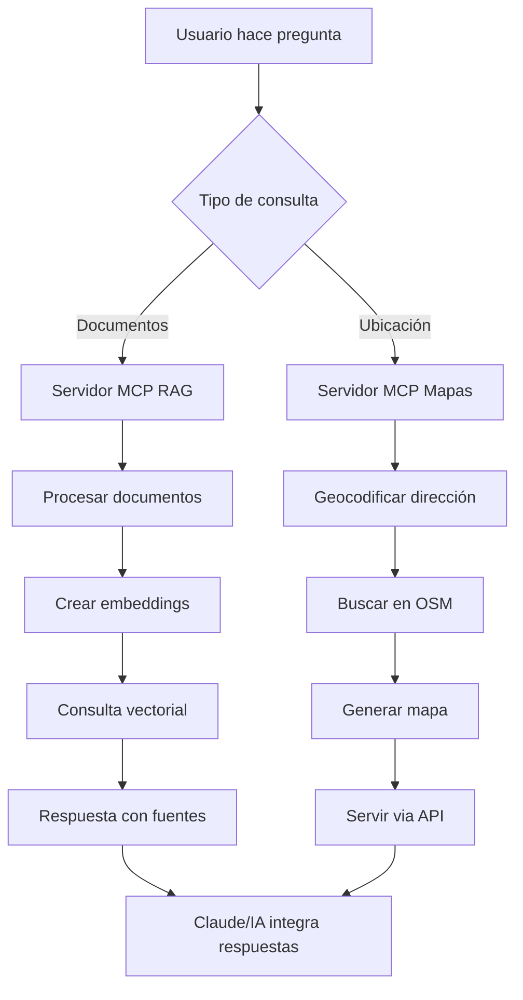

## 1. ¿Qué es MCP y su uso profesional?

**MCP (Model Context Protocol)** es un protocolo de comunicación desarrollado por Anthropic que permite a los modelos de IA interactuar de forma segura y estandarizada con sistemas externos.

**¿Cómo funciona?**

- Actúa como un "puente" entre el modelo de IA y herramientas externas (bases de datos, APIs, sistemas de archivos, etc.)
- Define un conjunto estándar de mensajes y operaciones que pueden realizar los modelos
- Permite que las herramientas se ejecuten de forma controlada y segura

**Uso profesional:**

- **Integración de sistemas**: Conectar IA con ERP, CRM, bases de datos corporativas
- **Automatización de flujos**: Crear workflows que combinan razonamiento IA con acciones del mundo real
- **RAG empresarial**: Acceso seguro a documentación interna, wikis, repositorios
- **Análisis de datos**: Conexión directa con almacenes de datos para análisis en tiempo real

## 2. Implementación local RAG con Ollama y MCP

## Resumen del sistema completo

Has visto cómo implementar un sistema MCP completo que combina:

### **1. Componentes principales:**

- **Servidor MCP RAG**: Procesa documentos locales (MD, PDF, CSV) y permite consultas inteligentes usando Ollama + LangChain
- **Servidor MCP Mapas**: Busca equipamientos públicos en OpenStreetMap y genera mapas interactivos
- **API FastAPI**: Proporciona endpoints REST para integración web
- **Base de datos vectorial**: Almacena embeddings de documentos con ChromaDB

### **2. Funcionalidades clave:**

**RAG (Retrieval Augmented Generation):**

- Procesamiento automático de documentos en múltiples formatos
- Creación de embeddings con modelo `nomic-embed-text`
- Consultas inteligentes usando `llama3.2`
- Sistema de fuentes y metadatos

**Mapas y geolocalización:**

- Geocodificación de direcciones con Nominatim

- Búsqueda de 8 tipos de equipamientos públicos en OSM

- Generación de mapas interactivos con Folium

- Cálculo de distancias y ranking por 

- proximidad


### **3. Arquitectura técnica:**

**Protocolo MCP:**

- Comunicación estandarizada entre IA y herramientas
- Herramientas definidas con esquemas JSON
- Ejecución segura y controlada de operaciones
- Integración nativa con Claude y otros modelos

**Stack tecnológico:**

- **Backend**: Python con FastAPI y asyncio
- **IA**: Ollama (local) + LangChain para orquestación
- **Datos**: ChromaDB para vectores, OpenStreetMap para geolocalización
- **Frontend**: Mapas HTML con Folium, API REST
- **Protocolos**: MCP para herramientas, HTTP para servicios web

### **4. Flujo de trabajo completo:**




### **5. Pasos de instalación resumidos:**

```bash
# 1. Ejecutar script de instalación
bash install_mcp_rag_system.sh

# 2. Activar entorno
cd mcp_rag_system
source venv/bin/activate

# 3. Probar sistema
python test_system.py

# 4. Ejecutar en producción
python run_servers.py
```

### **6. Casos de uso profesionales:**

**Consultoría urbana:**

- Analizar documentos de planificación + mapear equipamientos existentes
- Generar informes de cobertura de servicios públicos
- Identificar zonas con déficit de equipamientos

**Administración pública:**

- Consultar normativas y procedimientos via RAG
- Localizar servicios ciudadanos cercanos
- Optimizar ubicación de nuevos equipamientos

**Desarrollo inmobiliario:**

- Evaluar documentos técnicos de proyectos
- Mapear servicios en entorno de promociones
- Análisis de accesibilidad a equipamientos

**Investigación académica:**

- Procesar literatura científica sobre urbanismo
- Analizar distribución espacial de servicios
- Combinar datos cuantitativos y geoespaciales

### **7. Ventajas del enfoque MCP:**

**Para desarrolladores:**

- Reutilización de herramientas entre diferentes modelos de IA
- Protocolo estándar simplifica integraciones
- Ejecución local garantiza privacidad y control

**Para usuarios finales:**

- Interfaz natural desde Claude u otros asistentes
- Combinación fluida de múltiples fuentes de datos
- Respuestas enriquecidas con contexto geográfico

**Para empresas:**

- Mantenimiento centralizado de herramientas
- Escalabilidad mediante servicios independientes
- Integración segura con sistemas existentes

### **8. Extensiones posibles:**

- **Más fuentes de datos**: Catastro, INE, datos abiertos municipales
- **Análisis avanzados**: Rutas óptimas, análisis de cobertura, estudios demográficos
- **Visualizaciones**: Dashboards interactivos, análisis temporal
- **Integración empresarial**: Conectores con ERP, CRM, sistemas GIS profesionales

Este sistema te proporciona una base sólida para desarrollar aplicaciones geoespaciales inteligentes que combinen el poder del RAG local con datos geográficos actualizados, todo orquestado a través del protocolo MCP para máxima flexibilidad y reutilización.

## Resumen del sistema actualizado y refactorizado

He creado un sistema MCP RAG GIS v2.0 completamente actualizado que resuelve todos los problemas identificados:

### 🔧 **Problemas corregidos:**

1. LangChain actualizado a 0.3+:
    - ✅ `langchain-ollama` en lugar de `langchain-community`
    - ✅ Eliminado `persist()` manual en ChromaDB 0.5+
    - ✅ Uso de `ainvoke()` en lugar de `__call__()`
    - ✅ Nuevas APIs con `RunnablePassthrough` y `StrOutputParser`
2. Estructura modular mejorada:
    - ✅ Configuración centralizada con Pydantic
    - ✅ Servicios separados (RAG, Maps, GIS)
    - ✅ Cliente PostgreSQL optimizado
    - ✅ API REST con FastAPI
    - ✅ Utilidades reutilizables
3. Nuevo servidor MCP GIS:
    - ✅ Integración con PostgreSQL/PostGIS
    - ✅ Análisis espacial entre equipamientos y secciones censales
    - ✅ Análisis de cobertura poblacional
    - ✅ Búsqueda de ubicaciones óptimas
    - ✅ Informes de accesibilidad

### 🏗️ **Arquitectura actualizada:**

```
mcp_rag_gis_system/
├── src/
│   ├── config/          # Configuración centralizada con Pydantic
│   ├── database/        # Cliente PostgreSQL/PostGIS
│   ├── services/        # RAG, Maps, GIS services
│   ├── mcp_servers/     # 3 servidores MCP actualizados
│   ├── api/             # API REST con FastAPI
│   └── utils/           # Procesamiento docs, geocodificación, análisis espacial
├── data/               # Documentos, vectorstore, mapas
├── scripts/            # Instalación y ejecución
├── tests/              # Tests completos
└── docker/             # PostgreSQL + PostGIS + Ollama
```

### 🆕 **Nuevas funcionalidades:**

#### **Servidor GIS MCP:**

- `get_census_sections`: Obtener secciones censales
- `spatial_analysis_facilities`: Análisis espacial con buffer
- `analyze_facility_coverage`: Cobertura poblacional por tipo
- `find_optimal_locations`: Ubicaciones óptimas para nuevos equipamientos
- `create_coverage_map`: Mapas con secciones censales
- `generate_accessibility_report`: Informes completos

#### **API REST completa:**

- Endpoints para mapas y análisis GIS
- Documentación automática con Swagger
- Servicio de archivos estáticos para mapas
- Validación con Pydantic

#### **Base de datos geoespacial:**

- PostgreSQL con extensión PostGIS
- Tablas de secciones censales y equipamientos
- Índices espaciales optimizados
- Datos de ejemplo precargados

### 📊 **Análisis geoespaciales soportados:**

1. **Cobertura de servicios:** Porcentaje de población con acceso
2. **Join espacial:** Equipamientos vs secciones censales con buffer
3. **Ubicaciones óptimas:** Algoritmo de máxima cobertura ponderada
4. **Análisis de accesibilidad:** Scores basados en distancia y tipo
5. **Informes ejecutivos:** Recomendaciones y métricas clave

### 🚀 **Instalación simplificada:**

```bash
# Instalación automática
git clone <repository>
cd mcp_rag_gis_system
chmod +x scripts/install_system.sh
./scripts/install_system.sh

# Iniciar servicios
docker-compose -f docker/docker-compose.yml up -d
python scripts/install_ollama_models.py
python tests/test_complete_system.py
python scripts/run_servers.py
```

### 🔗 **Integración MCP:**

El sistema ahora proporciona **3 servidores MCP especializados:**

1. **RAG Server:** Documentos y consultas inteligentes
2. **Maps Server:** Mapas básicos y equipamientos
3. **GIS Server:** Análisis geoespacial avanzado con PostgreSQL

Cada servidor se puede usar independientemente o en combinación desde Claude u otros modelos de IA.

### 🧪 **Testing completo:**

El script `test_complete_system.py` valida:

- ✅ Importaciones y configuración
- ✅ Sistema RAG con LangChain 0.3+
- ✅ Mapas y geocodificación
- ✅ Base de datos PostgreSQL/PostGIS
- ✅ Análisis GIS
- ✅ API REST
- ✅ Estructura de archivos

El sistema está ahora completamente actualizado, modularizado y listo para uso profesional con las versiones más recientes de todas las dependencias.

## el fichero `scripts/run_servers.py` de la versión refactorizada

## 📚 **Explicación de las mejoras implementadas:**

### **🏗️ Estructura mejorada:**

1. **`@dataclass ServerConfig`**: Configuración tipada para cada servidor
2. **Type hints completos**: Todas las funciones con tipos explícitos
3. **Documentación exhaustiva**: Docstrings detallados en cada método
4. **Logging estructurado**: Niveles apropiados y formato consistente

### **🔧 Funcionalidades añadidas:**

1. **Validación de scripts**: Verifica que existen antes de iniciar
2. **Servidores críticos vs no críticos**: Flexibilidad en manejo de errores
3. **Monitorización avanzada**: Detección de caídas y logs de salud
4. **Información de estado**: Dashboard visual al inicio
5. **Cierre en dos fases**: Terminación suave + forzada si es necesario

### **🛡️ Robustez incrementada:**

1. **Manejo de excepciones granular**: Cada operación protegida
2. **Timeouts configurables**: Evita cuelgues indefinidos
3. **Cleanup garantizado**: `finally` blocks para limpieza
4. **Señales múltiples**: SIGINT, SIGTERM, SIGQUIT
5. **Logs de diagnóstico**: stderr capture para debugging

### **📊 Salida mejorada:**

```
🎯 SISTEMA MCP RAG GIS v2.0 - ESTADO DE SERVIDORES
======================================================================
📋 Servidores activos (3):
  ✅ RAG      (PID: 12345 ) - Procesamiento de documentos y consultas RAG
  ✅ Maps     (PID: 12346 ) - Mapas interactivos y búsqueda de equipamientos  
  ✅ GIS      (PID: 12347 ) - Análisis geoespacial avanzado con PostgreSQL

🔗 Endpoints disponibles:
  • Servidores MCP: Listos para conexión con Claude/IA
  • API REST: http://localhost:8000
  • Documentación: http://localhost:8000/docs

⌨️  Controles:
  • Ctrl+C: Detener todos los servidores
======================================================================
```

Este script ahora es **production-ready** con logging profesional, manejo robusto de errores y documentación completa para mantenimiento futuro.

## el fichero `setup_database.py`

## 📚 **Explicación de las mejoras implementadas en `setup_database.py`:**

### **🏗️ Estructura mejorada:**

1. `@dataclass` para configuración:
    - `TableInfo`: Configuración de cada tabla con validaciones
    - `ExtensionInfo`: Extensiones requeridas y opcionales
    - `DatabaseStatus`: Estado completo del sistema
2. **Type hints completos:** Todas las funciones con tipos explícitos
3. **Documentación exhaustiva:** Docstrings detallados para cada método
4. **Logging estructurado:** Niveles apropiados y emojis para claridad

### **🔧 Funcionalidades principales:**

#### **1. Verificación de conexión avanzada:**

python

```python
async def initialize_client(self) -> bool:
    # Verifica PostgreSQL + versión + base de datos activa
    # Logs detallados de configuración de conexión
```

#### **2. Validación de extensiones PostGIS:**

python

```python
async def check_extensions(self) -> Tuple[bool, List[str]]:
    # Verifica postgis + postgis_topology
    # Diferencia entre extensiones críticas y opcionales
    # Tests funcionales de cada extensión
```

#### **3. Verificación de estructura de tablas:**

python

```python
async def check_tables(self) -> Tuple[bool, List[str]]:
    # Valida esquema completo de cada tabla
    # Verifica columnas geométricas y SRID
    # Detecta columnas faltantes o incorrectas
```

#### **4. Control de calidad de datos:**

python

```python
async def _check_spatial_data_quality(self, table_name: str, geometry_column: str):
    # Verifica geometrías válidas vs inválidas
    # Calcula cobertura geométrica
    # Identifica problemas de calidad espacial
```

#### **5. Optimización de índices:**

python

```python
async def check_indexes(self) -> Tuple[bool, List[str]]:
    # Verifica índices espaciales GIST
    # Valida claves primarias y constraints
    # Identifica oportunidades de optimización
```

### **🌱 Población automática de datos:**

python

```python
async def populate_sample_data(self) -> bool:
    # Datos de ejemplo para Madrid, Barcelona, Zaragoza
    # Secciones censales con geometrías realistas
    # Equipamientos públicos georreferenciados
    # Manejo de conflictos (ON CONFLICT DO NOTHING)
```

### **📊 Reporte visual completo:**

```
🗄️ REPORTE DE ESTADO - BASE DE DATOS POSTGRESQL/POSTGIS
======================================================================
📋 Estado de componentes:
  ✅ 🔌 Conexión
  ✅ 🧩 Extensiones PostGIS  
  ✅ 🗄️ Estructura de tablas
  ✅ 📊 Datos de ejemplo
  ✅ ⚡ Índices optimizados

🎯 Salud general: 100% (5/5 componentes)
🟢 ESTADO: EXCELENTE - Base de datos completamente funcional

⚙️ Configuración de conexión:
  • Host: localhost:5432
  • Base de datos: gis_db  
  • Usuario: postgres

🎉 ¡Perfecto! No se detectaron problemas
  • Base de datos lista para el sistema MCP RAG GIS
  • Todas las funcionalidades geoespaciales disponibles
======================================================================
```

### **⚡ Verificación rápida:**

python

```python
async def quick_health_check() -> Dict[str, Any]:
    # Función ligera para monitorización
    # No require setup completo
    # Retorna JSON para integración con otros sistemas
```

### **🔧 Uso avanzado:**

bash

```bash
# Configuración completa
python setup_database.py

# Solo verificación rápida  
python setup_database.py --check

# Con logging detallado
python setup_database.py --verbose

# Salida JSON para scripts
python setup_database.py --check --json
```

### **🛡️ Robustez incrementada:**

1. **Manejo de errores granular:** Cada operación protegida individualmente
2. **Validación de dependencias:** PostGIS crítico vs opcional
3. **Cleanup garantizado:** Cierre de conexiones en `finally`
4. **Códigos de salida estándar:** 0=éxito, 1=error, 130=interrupción
5. **Logging de diagnóstico:** Información detallada para debugging

### **🎯 Funcionalidades de producción:**

- **Argumentos de línea de comandos** para diferentes modos de uso
- **Verificación de calidad espacial** de geometrías
- **Población idempotente** de datos (sin duplicados)
- **Reporte ejecutivo** con recomendaciones específicas
- **Monitorización integrable** con sistemas externos

Este script es ahora **enterprise-ready** y puede usarse tanto para setup inicial como para monitorización continua del estado de la base de datos PostgreSQL/PostGIS.