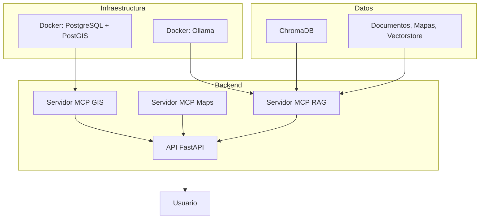

# MCP RAG GIS System

**MCP RAG GIS System** es una plataforma modular que integra inteligencia artificial (IA), recuperación aumentada de información (RAG), análisis geoespacial y generación de mapas interactivos, todo orquestado mediante el protocolo MCP (Model Context Protocol) para máxima interoperabilidad y flexibilidad.

## 🚀 Características principales

- **RAG local** con Ollama + LangChain: Procesamiento y consulta inteligente de documentos (MD, PDF, CSV) usando grandes modelos de lenguaje.
- **Análisis geoespacial avanzado**: Integración completa con PostgreSQL/PostGIS y algoritmos de cobertura, accesibilidad y localización óptima de equipamientos.
- **Mapas interactivos**: Generación automática de mapas (Folium) y búsqueda de equipamientos públicos vía OpenStreetMap.
- **API REST robusta**: Servida con FastAPI, endpoints documentados y servicio estático para mapas.
- **Arquitectura modular y escalable**: Separación clara entre servidores (RAG, Maps, GIS) y utilidades reutilizables.
- **Testing y validación**: Scripts automáticos para pruebas e instalación, con dashboard de monitoreo de servicios y base de datos.

## 🏗️ Arquitectura

```
mcp_rag_gis_system/
├── src/
│   ├── config/          # Configuración centralizada (Pydantic)
│   ├── database/        # Cliente PostgreSQL/PostGIS
│   ├── services/        # Servicios RAG, Maps, GIS
│   ├── mcp_servers/     # Servidores MCP
│   ├── api/             # API REST (FastAPI)
│   └── utils/           # Utilidades de procesamiento y análisis
├── data/               # Documentos, mapas y vectores
├── scripts/            # Instalación, despliegue y utilidades
├── tests/              # Testing completo
└── docker/             # Contenedores PostgreSQL+PostGIS+Ollama
```

## ⛓ Esquema general del sistema




## 🗺️ Casos de uso

- Consultoría urbana y administración pública
- Desarrollo inmobiliario y análisis académico
- Integración empresarial con sistemas GIS, ERP, CRM

## ⚙️ Instalación rápida

```bash
git clone https://github.com/emilio1310Git/mcp_rag_gis_system.git
cd mcp_rag_gis_system
chmod +x scripts/install_system.sh
./scripts/install_system.sh

# Inicializa servicios
docker-compose -f docker/docker-compose.yml up -d
python scripts/install_ollama_models.py
python tests/test_complete_system.py
python scripts/run_servers.py
```

## 📚 Documentación y ayuda

- Todos los endpoints REST están documentados automáticamente en: [http://localhost:8000/docs](http://localhost:8000/docs)
- Para más detalles técnicos, consulta `implementacion.md`.

## 🧩 Extensible

- Soporta nuevas fuentes de datos (Catastro, INE, etc.), análisis avanzados, visualizaciones y conectores empresariales.

## 🔐 Beneficios

- Privacidad y control total (ejecución local)
- Integraciones seguras y reutilizables (protocolo MCP)
- Escalabilidad y mantenimiento centralizado

---

© 2025. Desarrollado por emilio1310Git. Licencia MIT.